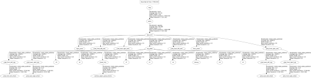
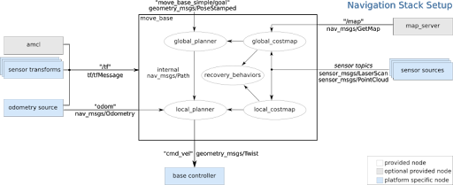
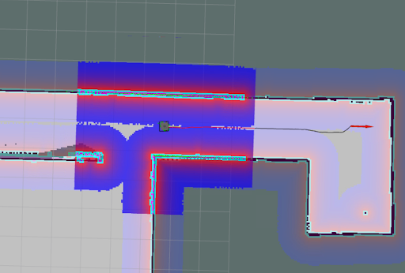

# Dependencies
A few packages are needed to run this project.

As seen in the package.xml, the following are needed:
    gmapping
    pedsim
    roscpp
    map_server
    move_base
    move_base_msgs
    geometry_msgs
    std_msgs
    gazebo_msgs
    people_msgs
    actionlib
    tf


# Installation


The following will need to be installed manually. 

gmapping:
````
sudo apt install ros-melodic-gmapping
````
pedsim:
````
cd ~/catkin_ws/src
git clone --recurse-submodules https://github.com/ral-stevens/CPE631Final.git
cd ~/catkin_ws
````
people_msgs:
````
sudo apt install ros-melodic-people-msgs
catkin_make
````

# Running the code

## Pioneer3AT
To run the Pioneer3AT robot that runs into the wall, four terminals are needed:

With the first one, run 
````
roslaunch cpe631-final gmappingLnch.launch
````

This launch file launches the following nodes:
    joint _state_publisher
    Robot_state_publisher
    Rviz
    Pedestrian_simulator
    Gazebo
	
With the second one, run
````
roslaunch cpe631-final move_base.launch
````

This launch file launches the following nodes:
    Map_server
    All move_base nodes


With the third one, run
````
rosrun amcl amcl scan:=laser/scan _initial_pose_x:=1.0 _initial_pose_y:=-3.0
````
This command launches AMCL


With the fourth one, run 
````
rostopic pub /move_base_simple/goal geometry_msgs/PoseStamped '{header: {stamp: now, frame_id: "map"}, pose: {position: {x: 14.0, y: -1.0, z: 0.0}, orientation: {w: 1.0}}}'
````

This command publishes a goal topic.


## Turtlebot3 no pedestrians
To run the Turtlebot3 Waffle with no pedestrians and using the usual navigation stack, three terminals are needed:

With the first one, run 
````
roslaunch cpe631-final turtlebot_init.launch ped:=false
````
This launch file will either start Gazebo with no pedestrians or start Gazebo with pedestrians and also start the pedsim_simulator node to move the pedestrians.

With the second one, run
````
roslaunch cpe631-final turtlebot_nav.launch han:=false
````
This launch file will launch either:
    Robot_state_publisher
    Map_server
    AMCL
    Move_base
    Rviz
Or:
    Map_server
    Move_base with human aware navigation algorithms
    rviz

With the third one, run
````
rostopic pub /move_base_simple/goal geometry_msgs/PoseStamped '{header: {stamp: now, frame_id: "map"}, pose: {position: {x: 14.0, y: -1.0, z: 0.0}, orientation: {w: 1.0}}}'
````

## Turtlebot3 with pedestrians
To run the Turtlebot3 Waffle with pedestrians, simply run the previous 3 commands but omit the “ped:=false” argument from the first command. 

To run the Turtlebot3 Waffle with the Human Aware Navigation stack instead of the typical Navigation stack remove the “han:=false” argument from the second command. In addition add the command:
````
rosrun cpe631-final pedestrian_streamer output:=screen
````
Which will run the custom created people converter.


# Report

## Abstract

A robot is a tool that can be utilized to complete a task that a human would either not want to do, or would be incapable of doing. On the surface, this seems like it would be simple, however, the problem is that a robot is blind and has no context as to what the world is. A robot is really just a computer that uses sensors and algorithms to interpret the world. The algorithms in this project attempt to resolve the problem by enabling the robot to navigate from a starting point to a goal point given a map, while navigating around human obstacles.


## 1 Introduction

Assumptions:
	The robot is given a map to localize from
	The robot is given an initial position and a goal position
	Pedestrian locations are always known
	
	
### 1.1 Map creation
Before any code is executed regarding the robot, a map must be created. The robot is controlled by a human or in other words, teleoperated instead of autonomously controlled around the world. Meanwhile, the robot is running the mapping algorithm, gmapping which reads the laser scan data to create a 2D map of the area. The result of the map is saved to a file using the map_saver type of the map_server package and can be seen in Figure 1. 


Figure 1: gmapping result map

### 1.2 Localization
Using the map from section 1.1, the robot will now have context of its environment. This will make it easier to plan a path to the goal later on. The AMCL package is a localization algorithm that uses the adaptive Monte Carlo localization approach. It takes in the laser scan, the map from the map_server type of the map_server package and the robot’s initial position and is able to estimate the location of the robot within the map. Simultaneously, AMCL gathers the odometry information which consists of sensor data such as robot acceleration, velocity, wheel rotation speed, orientation etc. to estimate its position per odometry. AMCL will compare these two estimates to localize the robot very accurately. The representation of AMCL’s estimation is in the form of Transforms.

### 1.3 Transforms

A transform is the distance and orientation of the robot in the world with respect to the center of the map. Every robot will have at least 3 transforms. The ‘map’ transform or frame, represents the center of the grid, in other words, the position of AMCL’s estimated 0, 0, 0 position of the map. A child of the map frame, the ‘odom’ frame as mentioned before in section 1.2, is the estimation of the robot's position using odometry. Figure 2 displays the hierarchy of transforms. The ‘base_link’ frame represents the base of the robot. It is important to have this frame as physical hardware on the robot must be represented in relation to the ‘base_link’. In the case of the Pioneer3AT robot, that is used in this report, if the laser sensor did not have the ‘front_sonar’ frame, the nodes that interpret the resulting laser scans would not know where the scans are in relation to the base of the robot and would calculate inaccurate results. 




Figure 2: Transform diagram


### 1.4 Navigation
In this report, the ros navigation stack is used to create a path that the robot will take to a goal. The navigation stack is represented as the move_base node depicted in Figure 3 which contains a few different packages including global and local planners. It's their job to ultimately publish a cmd_vel topic containing the velocity of the robot to follow the path.



Figure 3: Navigation

#### 1.4.1 Planners
There are a few different global costmap algorithms that can be implemented such as carrot_planner, navfn and global_planner. Same with the local planners. There are also multiple local planners such as dwa_local_planner, eband_local_planner and teb_local_planner. To plan a route, the planners use cost maps internally. 

#### 1.4.1 Costmap
A cost map is a quantized 2d map where each cell on the map contains an 8-bit value resulting in 256 possible integers per cell. From the map, previously generated by gmapping in section 1.1, a global costmap is calculated where the cells with high values represent an obstacle.  The cells in the cost map around an object will also contain values that slowly decrease the farther a cell is away from the object. The point of this is so that the path planner will plan a path containing the lowest possible cell values to its goal thus staying as far away from obstacles as it can. This can be seen in figure 4 where the robot stays right in the middle of the hallway. Unlike the global_costmap, which calculates a cost map from a previously generated map, the local_costmap uses the robot's sensors to create several cost maps around the robot. This enables the robot to navigate around objects that are in motion or have been moved since the gmapping scan of the environment took place. In addition to the global and local costmaps, there are a few different layers that are used as follows:
Static - base layer, interprets the map_server map directly
Obstacle - 2d and 3d obstacles
Inflation - obstacles are inflated to calculate cost for each 2d cell
Global - inflating obstacles on map
Local - inflating obstacles detected by sensors in real time



Figure 4: The robot follows areas of no object on costmap

## 2 Simulation
The simulation begins with replicating aspects of the real world. Gazebo was used to simulate not only the robot, but also the world in which the robot navigates in, how the robot interacts physically with its environment, and the sensors on the robot. The project is built off of the simulation in the pedsim library which includes the Altorfer map, the Pioneer3AT robot and code to spawn and move around pedestrians. Ros Kinetic is also used.

### 2.1 Pioneer3AT Simulation
When experimenting with unfamiliar code, it is important to only implement one aspect at a time. This refines the learning and comprehension of that additional part. As I was unfamiliar with all of the navigation stack going in, the first step was to get the robot to get to the goal. To simplify the environment, the pedestrians were removed from the Gazebo world. Of course a copy with the pedestrians was also saved. 

Now to map the world. A simple gmapping node was run along with a teleoperation node. There are a few teleop nodes that are included in the pedsim package. There is a robot_controller.launch file which loads a rqt_robot_steering node. This works well enough to get a simple scan of the environment. After a majority of the world is mapped, a map_saver node is executed from the map_server package to save the map, altorfer_map, as both a pgm image and a yaml description. This map file will be read in by the other node in the map_server package, the map_server node, to publish a /map topic to be read by AMCL. 

AMCL sends the updated transform to move_base in addition to the map that is sent from map_server to provide the navigation everything it needs to create a path. Now that the navigation stack is able to create a path, it is time to send a path through using the command:

````
rostopic pub /move_base_simple/goal geometry_msgs/PoseStamped '{header: {stamp: now, frame_id: "map"}, pose: {position: {x: 14.0, y: -1.0, z: 0.0}, orientation: {w: 1.0}}}'
````

Using rviz or ros visualization, the resulting path shown in figure 5 was inadequate as it did not leave enough room for the robot to clear the wall. The global and local planners include variables that can be altered to improve results for different environments. To keep the robot farther away from walls and in the middle of hallways and doorways, the cost_factor was increased to 0.55 from 0.25. The resulting path was more preferable as it stayed in the middle of doorways and hallways as seen in figure 6. It was at this point when it was noted that the Pioneer3AT was unable to turn due to its wheels spinning in different directions as seen in Figure 7.


Figure 5: Low cost_factor results in a path with minimal length, but hugs walls


Figure 6: Increasing the cost_factor, centralizes robot


Figure 7: Pioneer3AT wheels counteract rotation. In attempting a left turn, the robot should spin all wheels clockwise. It can be seen that the left front and right back wheels are spinning cw, however the left back and right front wheels are spinning ccw.


Using the Pioneer3AT robot is impossible as the movement driver is not coded correctly. The cmd_vel values were correct but the robot refused to follow it. It was time to move on to a different robot. 

### 2.2 Turtlebot3 Waffle Simulation
The next step in the saga is to replace the Pioneer3AT robot with a differential drive robot, or a robot that only uses two wheels instead of four. This eliminates the possibility of wheels counteracting each other. The selected replacement was the Turtlebot3 Waffle robot, a robot containing a small but wide base with a laser scanner on top. Another plus was that, unlike the top-heavy Pioneer3AT robot which would often fall over when colliding with a wall or a pedestrian, the Turtlebot would stay flat and could simply re-plan.

Depicted in Figure 8, the turtlebot is able to rotate fast enough to follow the path and makes it to the goal. Now that the robot has proven itself worthy, pedestrians can now be added back into the simulation. Using the standard planners in the move_base navigation stack, the turtlebot has a tough time getting to the goal without being kicked by the pedestrians as seen in Figure 9. The standard planners do not take moving objects into account. In this short demo, it can be seen that the local planner will add past pedestrian locations to the global costmap in the form of light blue pixels. Many of these false objects are removed after some time due to the fact that the refresh is not frequent. This is actually good because for an environment where there are no moving objects, if the scanner reads an incorrect distance, it will be able to compensate by waiting to compare it to the next reading from that location. In other words, the objects in the global cost_map are averages of past samples, so the more samples that are taken, the less outliers there are.


Figure 8: Turtlebot3 Waffle navigates to the goal


Figure 9: Turtlebot3 Waffle navigates to the goal with pedestrians and proceeds to get kicked around. The gif is played at 5X speed


### 2.3 Human Aware Navigation
For the robot to be able to first, understand where people are, and second, to be able to navigate around them in real-time, the Human Aware Navigation package is added. Instead of using the default global_planner, and dwa_local_planner from move_base, this package uses lattice_planner and timed_path_follower planners respectively. Pedestrians will contain a costmap around them following a gaussian distribution enabling the Human Aware Navigation stack the ability to predict the future path of the person. In addition, the path that is made includes several ways of avoiding moving obstacles. The Human Aware Navigation stack can plan to pass behind a person even though the perceived path goes through its current path. This is useful as current algorithms will avoid the pedestrian’s path altogether and move a greater distance in attempting to avoid the obstacle. In the case that there is no reasonable path, the Human Aware Navigation algorithms can include a wait into the path where the robot is not moving and will wait for a better path to open up. This stack of algorithms really seek to replicate the usual social queues that humans do without even thinking. Things like moving around a person at a comfortable distance or waiting for them to pass before moving are all typical social interactions that are not intuitive to robots. 

To enable the Human Aware Navigation algorithm to be able to account for the simulated pedestrians in Gazebo, some custom code must be written. Gazebo publishes the topic /gazebo/model_states where each message is of type gazebo_msgs::ModelStates. This must be converted to a /people topic of type people_msgs::People that the constant_velocty_prediction node subscribes to. 
	
Unfortunately, I was unable to integrate the Human Aware Navigation stack. There are a few algorithms which this stack uses that I am unfamiliar with. With maybe a day or two worth of more research, it is entirely possible to fully integrate this stack into the navigation. In figure 10, the current final result can be seen.


Figure 10: The robot is unable to move, most likely because a node is implemented incorrectly. Every few seconds, the pedestrian’s 3D costmaps are updated, but there is only one prediction.


## 3 Reflection

My first mistake was that I did not include the joint and robot state publishers. The purpose of these two nodes is to update all of the transforms and joints of the robot. Leaving this out meant that AMCL was not able to interpret the laser scan correctly and could not localize the robot. After wasting time creating my own transform updater node which I was never able to complete, I was informed by the TA, Zhuo who accurately informed me that I was missing the two nodes. After implementing them, AMCL was able to localize

Another mistake was that I tried sending the goal to move_base using the move_base_msgs::MoveBaseGoal message. This was the wrong approach as publishing the /move_base_simple/goal topic was more effective and was able to be executed simply through the command line.

Typically, the robot will be able to detect pedestrians by sending its sensor data to a people finding algorithm. Since the location of people are globally given, this is not needed. In the future, I will remove this crutch and try to navigate humans using other ros packages and integrate that into the project. In addition, implementing a camera can literally add an entire new dimension.

All in all, I have learned that there are open source algorithms for everything, it just takes some deep searching to find them. It is also very useful to abstract as much as possible so other packages can build off of each other and protocols can be created.


Citations


External ros packages
Ros-kinetic-move-base
Ros-kinetic-amcl
Ros-kinetic-map-server
Ros-kinetic-navigation


